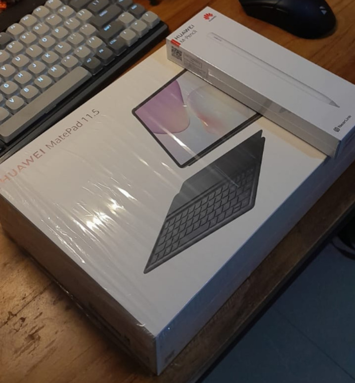
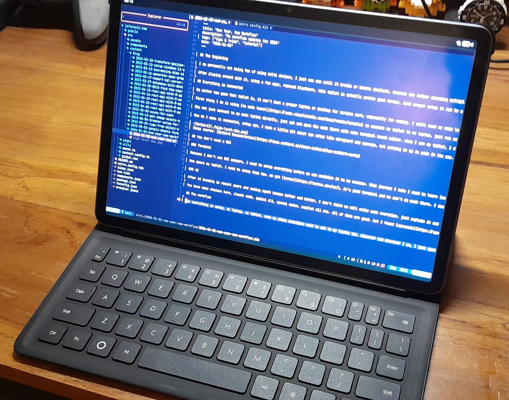
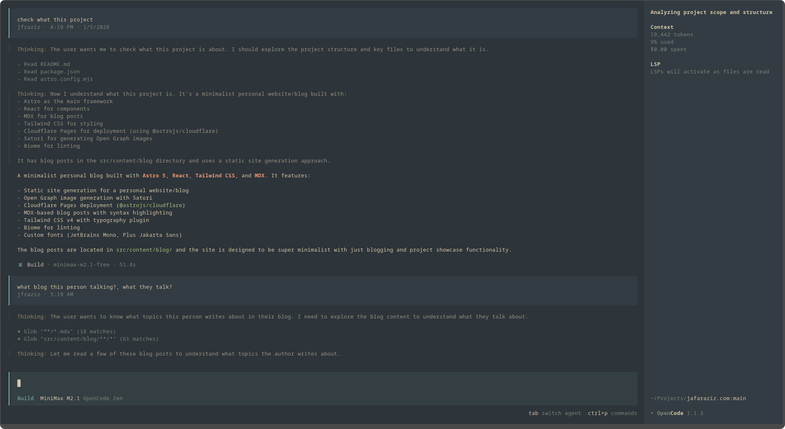

## The Beginning

I am personally not a fan of using multiple devices, I just use one until it breaks or becomes obsolete, because why bother managing multiple devices when one is enough? Then story begins when I got new Tablet as a doorprize at a conference back in August 2025. It's Huawei tablet, a new release tablet with decent specs at that time, I got keyboard and pen too, a good combo. But what now? for what will I use it for? I don't play mobile game, I don't draw, or it will be just another tech garbage in my home.

After playing around with it, I set up a few apps, removed bloatware, this tablet is actually a pretty good device, with proper setup it can be my secondary work device. It's light and I can bring it anywhere rather than lugging my heavy laptop. If I want to use it, I need to rethink how I work.

## Everything is connected

No matter how good that tablet is, it can't beat a proper laptop or desktop for serious work, especially for coding. I still need my main laptop for that. Then why not just make it connect to my laptop then, and code there.

The first thing I do is using [vs code tunnel](https://code.visualstudio.com/docs/remote/tunnels) to connect my tablet to my laptop, just run it on the server and open it in browser, now it's good to go. I use it sometimes, just to check some code. The ux is terrible, it's not that great, it's not the same as using vs code directly on laptop. too slow when setting up the project, because VS Code still downloads a bunch of plugins, sets up everything both in client and server, and sometimes it hangs.

Why not just connect to my main laptop directly, just ssh and open the code there with some terminal-based editor. When I use my tablet, I don't do heavy work, maybe just check the code. A terminal-based editor is enough.

How do I make it connected, set up a VPN, I know a little bit about VPN setup like Wireguard and OpenVPN, but setting it up is a pain in the ass. After doing some research on Reddit, some of them recommend tools like  [Tailscale](https://tailscale.com/), [Zeroiier](https://www.zerotier.com/), and [Netbird](https://netbird.io/) After digging sometimes, I tried Netbird, because it can be self-hosted, open-source, easy to set up, and just does what I need. Just connect the devices, and done, all are connected.

Image source: [Netbird Documentation](https://docs.netbird.io/about-netbird/how-netbird-works)

## You don't need a GUI

### Terminal

Because I don't use GUI anymore, I need to set up everything before we can maximize it to my use case. On this journey, I need to learn [Neovim](https://neovim.io/) as text editor, I don't want to fall into plugin hell so I just use [Lazyvim](https://www.lazyvim.org/) setup, it's enough for me, I don't need those fancy plugins.

How about my tablet, I need to set them up too. We got Termux, it's a good terminal and we can't do much there. I don't need to set up much, just install some fonts like Nerd Font, and a theme to make it look good to use. Main use case for this terminal is ssh to my laptop, so I don't need to set up much here. Here is a picture of my tablet setup with termux and open neovim through ssh.

### AI

After AI booming in recent years and coding agents become better and better, I don't think we will write code every time. Just explain it and they will work for you. As long as your code and prompt is easy to understand to them they can do what it needs to do.

You have many choices here, Claude Code, Gemini CLI, OpenAI Codex, Copilot CLI etc. All of them are good. But I found Opencode is better, the TUI is top notch, easy to use, and supports multiple AI models, I can even use my Copilot subscription there.

## The workflow

Now everything is set up, my laptop, my tablet, even my phone is sometimes used to SSH to my laptop too. Whenever and wherever I am, I just open my tablet, open termux, SSH to my laptop, open neovim, and start coding. Whenever I need AI help, I just open opencode, explain what I need, and they will help me to write the code.
